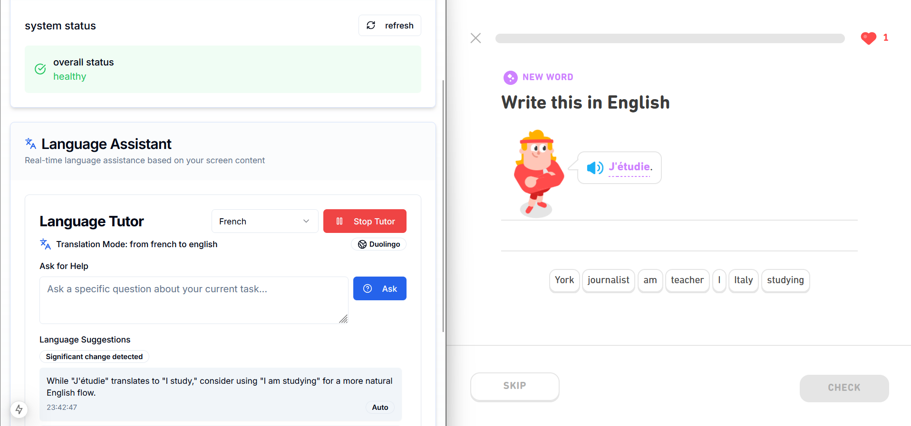

# Language Tutor Assistant

A real-time language learning assistant that analyzes your screen content and provides contextual language help using AI.

## Overview

Language Tutor Assistant is a Next.js application that uses Screenpipe to capture your screen content while you're learning a language. It analyzes what you're seeing, detects the language context, and provides helpful suggestions, corrections, and explanations to enhance your language learning experience.

## Features

- **Real-time Screen Analysis**: Captures and analyzes your screen content as you learn
- **Language Context Detection**: Automatically identifies source and target languages
- **Learning Platform Recognition**: Detects popular language learning platforms like Duolingo, Babbel, etc.
- **Adaptive Assistance**: Provides different types of help based on your learning context:
  - Grammar corrections and explanations
  - Alternative expressions
  - Vocabulary insights
  - Cultural context
- **Interactive Help**: Ask specific questions about what you're learning
- **Multiple Languages**: Supports English, French, Spanish, German, Italian, and more

## Prerequisites

- Node.js 18 or later
- Screenpipe service running locally (typically on port 3030)
- Groq API key for AI language assistance

## Environment Variables

The application requires the following environment variables:
